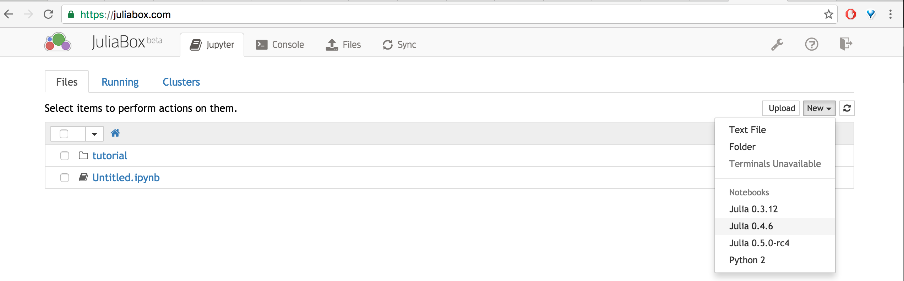
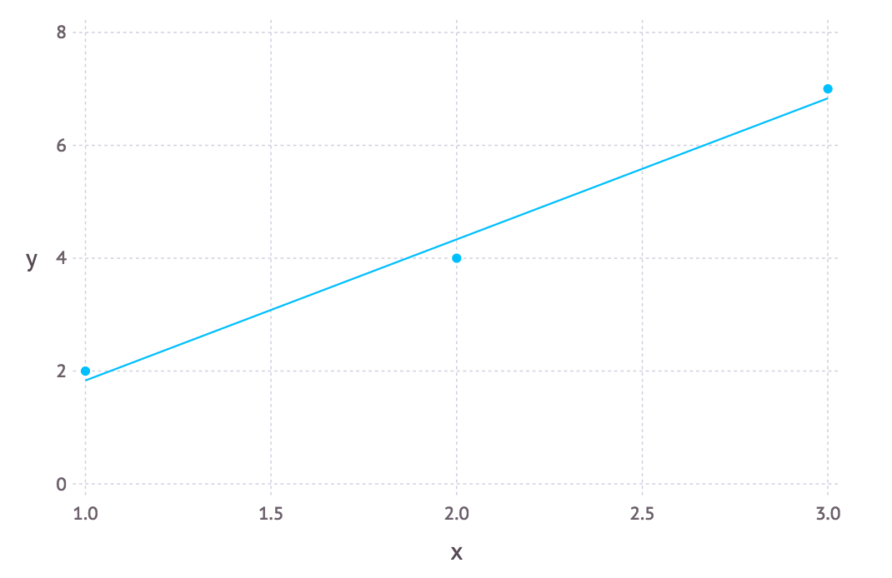

# FAQs

## Julia Basics

### Getting Started :

#### How to start using Julia?

There are three methods of using Julia,

1. Visit [JuliaBox](https://juliabox.com/), login with gmail or linked or github
 account and open a new notebook, preferably `0.4.6` kernel.
2. Install [`Julia`](http://julialang.org/downloads/) preferably the Current Release version which is `v0.4.6`.
3. Using the Juno IDE, which can be installed using the instructions [here](https://github.com/JunoLab/uber-juno/blob/master/setup.md).

#### Are there any learning material available online?

There is an abundance of learning material ranging from books, tutorial and video tutorials which can all the found [here](julialang.org/learning).

#### How to install a package?

To install any package locally or on `JuliaBox`(which is not available by default), do Pkg.add("name_of_package").
For e.x., if you need to install the package `JuMP` to Pkg.add("JuMP"). This is applicable to officially
registered packages. To know more about packages refer [package docs](http://docs.julialang.org/en/release-0.4/manual/packages/).

## Basics of programming in Julia

#### Julia Variables

To represent the various variable or scalar quantities like temperature or its gradient, you need a storage location which is identifiable by a symbolic name. A `Variable` in Julia is this entity which lets you manipulate and store values.

```
# Assign the value 10 to the variable x
julia> x = 10
10

# Doing math with x's value
julia> x + 1
11

# Reassign x's value
julia> x = 1 + 1
2

# You can assign values of other types, like strings of text
julia> x = "Hello World!"
"Hello World!"
```

#### Julia Integers and Floating-Point Numbers

Integers and floating-point values are the basic building blocks of arithmetic and computation. Julia provides a broad range of primitive numeric types, and a full complement of arithmetic and bitwise operators as well as standard mathematical functions are defined over them. Julia provides a number of primitive numeric types ranging from 8-bit to 128-bit,

-  **Integer types:**

| Type    | Signed? | Number of bits | Smallest value | Largest value |
|---------|---------|----------------|----------------|---------------|
| Int8    | ✓       | 8              | -2^7           | 2^7 - 1       |
| UInt8   |         | 8              | 0              | 2^8 - 1       |
| Int16   | ✓       | 16             | -2^15          | 2^15 - 1      |
| UInt16  |         | 16             | 0              | 2^16 - 1      |
| Int32   | ✓       | 32             | -2^31          | 2^31 - 1      |
| UInt32  |         | 32             | 0              | 2^32 - 1      |
| Int64   | ✓       | 64             | -2^63          | 2^63 - 1      |
| UInt64  |         | 64             | 0              | 2^64 - 1      |
| Int128  | ✓       | 128            | -2^127         | 2^127 - 1     |
| UInt128 |         | 128            | 0              | 2^128 - 1     |
| Bool    | N/A     | 8              | `false` (0)    | `true` (1)    |


-   **Floating-point types:**

| Type    | Precision | Number of bits |
|---------|-----------|----------------|
| Float16 | half\_    | 16             |
| Float32 | single\_  | 32             |
| Float64 | double\_  | 64             |

### Control flow

In general to achieve a large objective, we need to break it down into smaller tasks and perform these in a right sequence. Similarly programs too need to be well formulated as a properly sequenced series of instructions to the computer. There are various controlling capabilities provided, like conditional and repeated evaluation mechanisms.

#### How to calculate the sum of 10 integers, 1 to 10?

We introduce two basic repeated evaluation mechanisms, `which` and `for` loop,

```
julia> while i<=4
           println("$i th loop.")
           i += 1
       end
1 th loop.
2 th loop.
3 th loop.
4 th loop.
```

The `while` loop evaluates the condition expression (`i <= 4` in this case), and as long it remains `true`, keeps also evaluating the body of the `while` loop. If the condition expression is `false` when the `while` loop is first reached, the body is never evaluated.

```
julia> for i = 1:4
         println(i)
       end
1
2
3
4
```

Here the `1:5` is a `Range` object, representing the sequence of numbers 1, 2, 3, 4, 5. The `for` loop iterates through these values, assigning each one in turn to the variable `i`. One rather important distinction between the previous `while` loop form and the `for` loop form is the scope during which the variable is visible. If the variable `i` has not been introduced in an other scope, in the `for` loop form, it is visible only inside of the `for` loop, and not afterwards.

To show how to use this for a simple task of adding 10 numbers from 1:10,

```
julia> sum=0
0
julia> for i=1:10
           sum += i
       end
julia> println(sum)
65
```

### Basic datastructures in Julia

The basic datastructure to work with collection of data is an `Array` which can store data of type `T` in `n` dimensions, generic format of an array is `Array{T, n}`. For example if you need to store collection of `Int` type data in `2` dimensions, you need to declare `Array{Int, 2}()` (Note the parantheses creates an object of the corresponding type).

The following code snippets are extracted from a Julia REPL (read-eval-print loop), which can be also run in notebook as is,

```
julia> A = Array{Int, 2}()
0x0 Array{Int64,2}
```

You can check the type of an object,
```
julia> typeof(A)
Array{Int64,2}
julia> typeof(A)==Matrix{Int}
true
```
The typecheck done in the last step confirms that `A` is a `Matrix`. To declare a `Vector` (dimension=1),

```
julia> V = Array{Int, 1}()
0-element Array{Int64,1}
julia> Array{Int,1}==Vector{Int}
true
```
For example to represent the color red in RGB in decimal code,
```
julia>c=[255,0,0]
3-element Array{Int64,1}:
 255
   0
   0
```
#### How to add values to `Array`s arbitrarily?

If `A` is an `Int` type array, `A=Array{Int, 1}()`, we can populate the array as follows,

```
julia> A=Array{Int,1}()
0-element Array{Int64,1}

julia> push!(A,1)
1-element Array{Int64,1}:
 1

julia> for i = 2:5
           push!(A,i)
       end

julia> println(A)
[1,2,3,4,5]
```

## JuliaBox :

#### How to use JuliaBox?

Visit the [JuliaBox](https://juliabox.com/) page, you can
login through either of the three accounts, gmail, linkedin
or github.

#### Some basic notebook usage.

The landing page after login lists the files in the folder and on the top right corner you can create a new notebook, preferably `Julia 0.4.6`.



The cursor will be on the first cell initially and you can write code within the cell, to execute hit `shift+enter`.


#### How do I plot in `JuliaBox`?

There are various packages available for plotting in `Julia`, viz, `Gadfly`, `Plotlyjs`, `Pyplot`, `Plots` among others. `Plots`
is an interface to many of the other plotting libraries which act as backend. To create plots using `Plots` you have to select a backend, e.x., to select Plotlyjs, run `plotly()`,


## Troubleshooting :

#### Where can I ask specific questions to know how to accomplish anything you find tricky?

If the question is a "how to do ..." type, you can ask a well formulated question with code example if
possible on [julia-users group](https://groups.google.com/forum/#!forum/julia-users) or StackOverflow (tag as julia-lang).
Before posting the question make sure you have looked online beforehand for answers.

#### Can't add packages on Julia installed on laptop.

```
julia> using DataFrames
ERROR: ArgumentError: DataFrames not found in path
in require at loading.jl:249

julia> Pkg.add("DataFrames")
fatal: your current branch 'master' does not have any commits yet
ERROR: failed process: Process(git '--git-dir=C:\Users\user\.julia\v0.4\.cache\DataArrays' log --all --"
```

In this case it most likely is due to corrupt copies of packages. First remove the `.cache` folder at present in the `JULIA_PACKAGE` directory which is `~/.julia` where `~` is the home directory. Then do a `Pkg.update()`.

#### Where can I ask specific questions regarding issues or buggy behavior?

Please search for possibly already answered questions similar to yours on [julia-users group](https://groups.google.com/forum/#!forum/julia-users) or [StackOverflow](http://stackoverflow.com/search?q=julia-lang).

If you are convinced it to be a buggy behavior you can file an issue on the corresponding [julia package repository](http://pkg.julialang.org/) or [julia lang repository](https://github.com/JuliaLang/julia).

#### I am using JuliaBox (0.4.6) for a homework assignment and when I call functions from Python like PyPlot, I get an error. Any ideas? I have tried adding Pyplot package and PyCall. I have also downloaded Python 2.7 to my computer. I need to use the clf() function from Pyplot.

```
Error:
INFO: Recompiling stale cache file PyPlot.ji for module PyPlot.
```

Due to a precompilation issue on Julia and JuliaBox this error sometimes happens for packages that were `Pkg.add()`ed. To use the default PyPlot installed delete your `~/.julia`. You can do this by going to console and typing `rm -rf ~/.julia` or go to settings page and click on "Reset my packages" for instructions are available [here](https://docs.google.com/presentation/d/1G9ilT8qGbuIrT1o7QW-Pahbje-RBKlHDr9e4RqasUJY/edit#slide=id.p).

The precompilation issue will be fixed soon. The above instruction is a temporary workaround for now.

#### On `JuliaBox` when ever I try `Pkg.status()` or `Pkg.add()` I get the following error message,

```
INFO: Initializing package repository /home/juser/.julia/v0.4
INFO: Cloning METADATA from git://github.com/JuliaLang/METADATA.jl
Fatal: cannot create directory at 'Interpolations/versions/0.3.0': No space left on device
Warning: Clone succeeded, but checkout failed.
You can inspect what was checked out with 'git status'
And retry the checkout with 'git checkout -h HEAD'
```

As mentioned in the error message you have exceeded the allocated memory of 500MB. Please delete some of your data and try again.

## Data Science, Machine learning

#### How to solve a simple linear optimization problem?

This is a diet problem where one has to decide what nutritionally sound food to eat and in most cost effective manner, consider the data below which shows the nutrient values and cost of various food items (this is an example problem in MIT 15053),

|    | Hamburger | Large Hamburger| Chicken Sandwich | Chicken Salad | French Fries |
|---------|---------|----------------|----------------|---------------|--------|
| Total Calories | 250 | 770 | 360 | 190 | 230 |
| Fat Calories | 80 | 360 | 145| 45 | 100 |
| Protein | 30 | 45 | 15 | 25 | 3 |
| Sodium | 480 | 1170 | 800 | 580 | 160 |
| Cost per unit in $ | 1.0 | 3.0 | 2.5 | 3.0 | 1.0 |

#### Some of the constraints to be considered are,

1. Minimum calories is 600 and maximum calories is 900.
2. The maximum sodium content is 1150.
3. Minimum protein content should be 30.
4. 40% of the calories must be from fat.

#### How can we solve this in Julia?

Firstly for the algebraic formulation of the problem,

* Decision variables : `H`, `L`, `C`, `S` and `F`, number of Hamburgers, Large Hamburgers, chicken sandwiches, salad and french fries respectively.
* Objective function :  `min H+3L+2.5C+3S+F`
* Constraints :

>    `50*H+770*L+360*C+190*S+230*F>=600`
>    
>    `50*H+770*L+360*C+190*S+230*F<=900`
>    
>    `30*H+45*L+15*C+25*S+3*F>=30`
>    
>    `480*H+1770*L+800*C+580*S+160*F<=1150`
>    
>    `-20*H+52*L+1*C-31*S+8*F<=0`

Next to solve this problem using `JuMP`,

1. Initialize a model `m`,
```
    julia> m = Model()
    Feasibility problem with:
    * 0 linear constraints
    * 0 variables
    Solver is default solver
```
We can also select a solver, `m = Model(solver=GLPKSolverLP())` for which the package `GLPKMathProgInterface` needs to be installed.

2. Model the decision variables,
```
julia> @variable(m, H)
julia> @variable(m, L)
julia> @variable(m, C)
julia> @variable(m, S)
julia> @variable(m, F)
```
3. Set the objective
```
julia> @objective(m, Min, H+3L+2.5C+3S+F)
H + 3 L + 2.5 C + 3 S + F
```

4. Set the constraints
```
julia> @constraint(m, -20*H+52*L+1*C-31*S+8*F<=0)
-20 H + 52 L + C - 31 S + 8 F ≤ 0
julia> @constraint(m, 250*H+770*L+360*C+190*S+230*F>=600)
250 H + 770 L + 360 C + 190 S + 230 F ≥ 600
julia> @constraint(m, 250*H+770*L+360*C+190*S+230*F<=900)
250 H + 770 L + 360 C + 190 S + 230 F ≤ 900
julia> @constraint(m, 30*H+45*L+15*C+25*S+3*F>=30)
30 H + 45 L + 15 C + 25 S + 3 F ≥ 30
julia> @constraint(m, 480*H+1770*L+800*C+580*S+160*F<=1150)
480 H + 1770 L + 800 C + 580 S + 160 F ≤ 1150
julia> @constraint(m, H>=0)
H ≥ 0
julia> @constraint(m, L>=0)
L ≥ 0
julia> @constraint(m, C>=0)
C ≥ 0
julia> @constraint(m, S>=0)
S ≥ 0
julia> @constraint(m, F>=0)
F ≥ 0
```

5. Solve the model
```
julia> status = solve(m)
```

To see the results,

```
julia> println("Objective value: ", getobjectivevalue(m))
Objective value: 2.400568181818183
```

Hence 2.4$ needs to be spent to have a meal with the set of constraints. To see how many units of each food items to be had,

```
julia> println("The number hamburgers = ", getvalue(H))
The number hamburgers = 2.3934659090909087
```

Note that it is impossible to buy 2.3 units of hamburger, for this we can set restrict the variables to be `Integer`s.


#### How to perform simple statistical analysis on the structured data stored in a csv file?

In a file brain.csv which has a header row for column names like shown below,

Gender,FSIQ,VIQ,PIQ,Weight,Height,MRI_Count  
Female,133,132,124,118,64.5,816932  
Male,140,150,124,NaN,72.5,1001121  
Male,139,123,150,143,73.3,1038437  
Male,133,129,128,172,68.8,965353  
Female,137,132,134,147,65.0,951545  

##### Reading the data from csv,

```
df=readtable("brain.csv", nastrings=["NaN"], header=true)
```
|Gender|FSIQ|VIQ|PIQ|Weight|Height|MRI_Count|
|------|------|------|------|------|------|------|
|Female|133|132|124|118|64.5|816932|
|Male|140|150|124|NA|72.5|1001121|
|Male|139|123|150|143|73.3|1038437|
|Male|133|129|128|172|68.8|965353|
|Female|137|132|134|147|65.0|951545|

To find the mean of a column,

```
mean(df[:Weight])
```
This results in `NA` since one of the entries is not available. To deal with this,

```
mean(dropna(df[:Weight]))
```
which gives the value `145.0`.

To find the ratio of `Weight` to `MRI_Count`, let us say for only the `Female` class,

```
fem=df[df[:Gender].=="Female",:]
```
 Another useful function is `by()` using which we can find the means of `Height` for both the `Gender`s,

```
by(df, [:Gender], df -> mean(df[:Height]))
```
| |Gender|x1|
|--|--|--|
|1|Female|64.75|
|2|Male|71.53|

#### How to fit a set of points to a line?

```
data = DataFrame(X=[1,2,3], Y=[2,4,7])
```
| |X|Y|
|--|--|--|
|1|1|2|
|2|2|4|
|3|3|7|

```
OLS = glm(Y ~ X, data, Normal(), IdentityLink())
```
The output is as shown below,

```
Formula: Y ~ 1 + X

Coefficients:
              Estimate Std.Error  z value Pr(>|z|)
(Intercept)  -0.666667   0.62361 -1.06904   0.2850
X                  2.5  0.288675  8.66025   <1e-17
```

To predict from the model,
```
p=predict(OLS)
```

Let us plot the data and the predicted values to how good the fit is,

```
Gadfly.plot(layer(x=[1,2,3],y=p, Geom.line), layer(x=data[:X], y=data[:Y], Geom.point))
```


